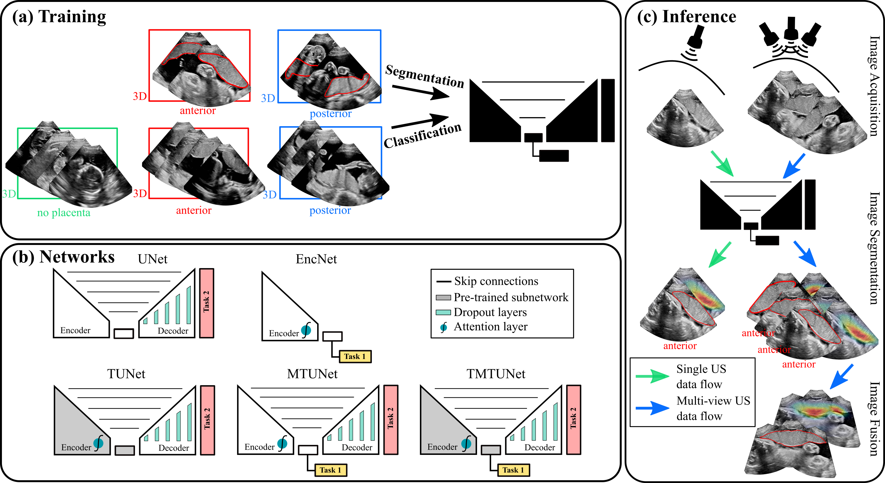

# multitask_seg_placenta

This repository hosts the code of the article [Placenta Segmentation in Ultrasound Imaging: Addressing Sources of Uncertainty and Limited Field-of-View](https://www.sciencedirect.com/science/article/pii/S1361841522002675). In this work, we propose a multi-task learning approach for placenta segmentation in ultrasound that combines the classification of placental location (e.g., anterior, posterior) and semantic placenta segmentation in a single convolutional network.

----

# Usage
mode: {train, infer, infer_mc}

- **EncNet** (Only classification)

        python classfy.py class_config mode

- **UNet** (Only segmentation)

        python segment.py segm_config1 mode

- **TUNet** (Segmentation with encoder pretrained on classification)

        python segment.py segm_config2 mode

- **MTUNet** (Multi-task Unet with classification and segmentation trained simultaneously)

        python multitask.py multi_config1 mode

- **TMTUNet** (Multi-task Unet with classification and segmentation trained simultaneously; Encoder and classification head pretrained on classification)

        python multitask.py multi_config2 mode

-----

- **Fusion** (Voxel-based weighted fusion to suppress view-dependent artifacts)  
*Calibrated to our 2- and 3-probe holder*   
fusion_method: {alignment, maximum, average, addition, frustum}  
Ours: frustum
N: number of images, which are specified in <code>fuse_images.py</code>

        python fuse_images.py N fusion_method

# Data
Information about data samples is provided in excel file <code>datainfo.xlsx</code> of the form:

| dataset     | image_name | segmentation | position | set |
| ----------- | ---------- | ------------ | -------- | --- |
| 1 | image_name_1 | 1 | anterior | train |
| 2 | image_name_2 | 1 | posterior | train |
| 3 | image_name_3 | 1 | anterior | train |
| 4 | image_name_4 | 1 | posterior | train |
| 5 | image_name_5 | 0 | none | train |
| 6 | image_name_6 | 0 | posterior | train |
| 7 | image_name_7 | 1 | anterior | validate |
| 8 | image_name_8 | 1 | anerior | test |

# Reference
If you use this code, please cite our MedIA 2023 paper

    @article{zimmer2023placenta,
        title={Placenta segmentation in ultrasound imaging: Addressing sources of uncertainty and limited field-of-view},
        author={Zimmer, Veronika A and Gomez, Alberto and Skelton, Emily and Wright, Robert and Wheeler, Gavin and Deng, Shujie and Ghavami, Nooshin and Lloyd, Karen and Matthew, Jacqueline and Kainz, Bernhard and Rueckert, Daniel and Hajnal, Joseph V and Schnabel, Julia A},
        journal={Medical Image Analysis},
        volume={83},
        pages={102639},
        year={2023},
        publisher={Elsevier}
    }
